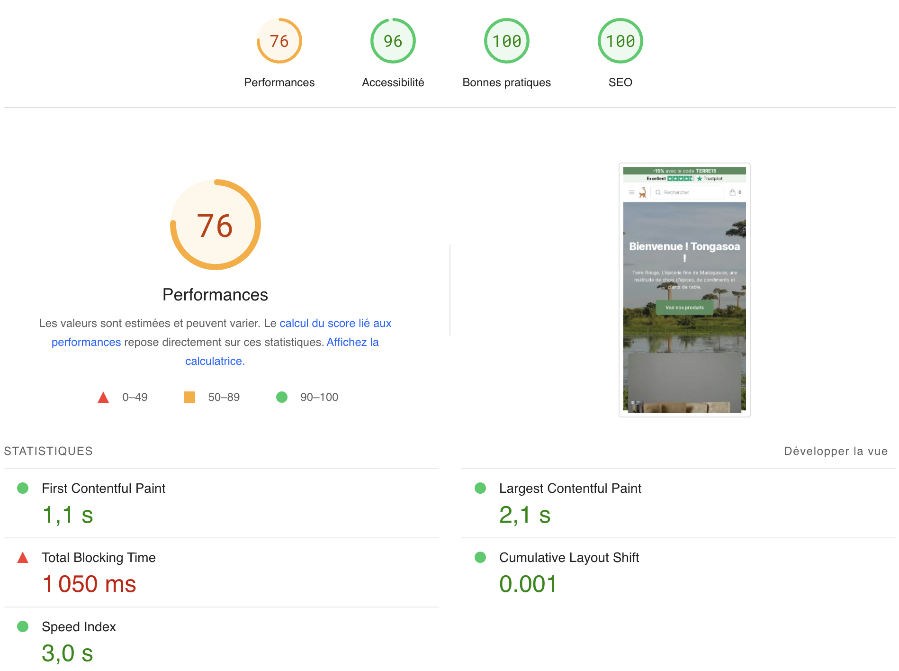

# terre-rouge.shop

[terre-rouge.shop](https://terre-rouge.shop) is an headless ecommerce website built in TypeScript with Next.js, Algolia, TailwindUI, HeadlessUI, React Query and Shopify Storefront GraphQL API.

## Table of Contents

- [Description](#description)
- [Tech Stack](#tech-stack)
- [Third parties](#third-parties)
- [Performances](#performances)
- [Features](#features)
- [Incoming Features](#incoming-features)
- [Installation](#installation)
- [Deployment](#deployment)
- [License](#license)

## Description

[terre-rouge.shop](https://terre-rouge.shop) is a web application that allow users to order Malagasy spices with a focus on performance and user experience.

The application is built with Next.js, a popular React-based framework for building web applications. It is also integrated with Algolia for search functionality, Partytown for performance optimization, TailwindUI and HeadlessUI for UI components, React Query for data fetching, Sentry for error monitoring, GraphQL for data management, and TypeScript for type safety.

## Tech Stack

- [Next.js](https://nextjs.org/)
- [Algolia](https://www.algolia.com/)
- [Partytown](https://github.com/BuilderIO/partytown)
- [TailwindUI](https://tailwindui.com/)
- [HeadlessUI](https://headlessui.dev/)
- [React Query](https://react-query.tanstack.com/)
- [Sentry](https://sentry.io/)
- [GraphQL](https://graphql.org/)
- [TypeScript](https://www.typescriptlang.org/)

## Third parties

- [Facebook pixel](https://www.facebook.com/business/tools/meta-pixel)
- [Google analytics pixel](https://developers.google.com/analytics/devguides/collection/ga4?hl=fr)
- [Trustpilot](https://fr.trustpilot.com/review/terre-rouge.shop?utm_medium=trustbox&utm_source=MicroReviewCount)

## Performances

The primary objectives of this website are to ensure it is both user-friendly and fast 🚀.

In order to achieve these goals, the following tools are used:

🎉 Partytown is a library that uses web workers to load third-party libraries, which can otherwise negatively impact lighthouse scores.

🔍 Algolia is used for fast search results, while Next.js is used for static page rendering.

⚠️ However, Next.js ships excessive JavaScript, resulting in a lower performance score (76).

> I'm currently working on a migration to [Astro](https://astro.build/) to solve this issue.

## Features

- Using storefront Shopify API
- Algolia autocomplete for global search
- Category page plugged to algolia search results
- Handleing cart

## Incoming features

- Cookie banner
- Custom checkout
- Storybook (sanitize components)
- Improve performances (Switching to Astro)
- Improve SEO

## Deployment

The website is hosted on [Vercel](https://vercel.com/) platform.

## License

MIT
